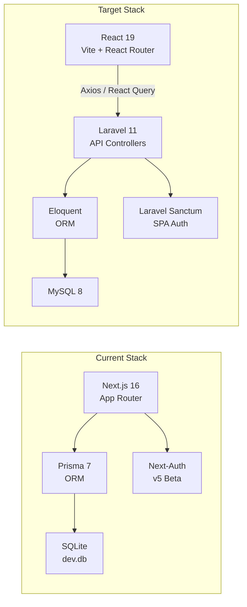

# SIBA Platform — Complete Migration Plan
## Next.js / Prisma / SQLite → React Router (Vite) / Laravel / MySQL

---

## 🏗️ Architecture Comparison



---

## 📂 Project Structure Map

### Directory Layout (New)

```
d:\Training Platform\
├── siba-api/                    ← Laravel Backend (NEW)
│   ├── app/
│   │   ├── Http/Controllers/Api/
│   │   │   ├── AuthController.php
│   │   │   ├── CourseController.php
│   │   │   ├── EnrollmentController.php
│   │   │   ├── LessonController.php
│   │   │   ├── BusinessController.php
│   │   │   ├── CertificateController.php
│   │   │   └── AiController.php
│   │   └── Http/Middleware/
│   │       └── CheckRole.php
│   ├── app/Models/
│   │   ├── User.php
│   │   ├── Course.php
│   │   ├── Module.php
│   │   ├── Lesson.php
│   │   ├── Enrollment.php
│   │   ├── BusinessPlan.php
│   │   └── ... (17 models total)
│   ├── database/migrations/
│   │   ├── 000001_create_users_table.php
│   │   ├── 000002_create_course_system_tables.php
│   │   ├── 000003_create_assessment_tables.php
│   │   ├── 000004_create_progress_tables.php
│   │   ├── 000005_create_business_tables.php
│   │   ├── 000006_create_mentor_tables.php
│   │   ├── 000007_create_community_tables.php
│   │   └── 000008_create_notification_tables.php
│   └── routes/api.php
│
├── siba-frontend/               ← Vite + React (NEW)
│   ├── src/
│   │   ├── components/ui/       ← COPIED from atcms (unchanged)
│   │   ├── components/dashboard/← COPIED from atcms (unchanged)
│   │   ├── hooks/               ← NEW (React Query hooks)
│   │   ├── store/               ← Zustand auth store
│   │   ├── layouts/             ← Root, Dashboard, Public
│   │   ├── pages/
│   │   │   ├── public/          ← Landing, Catalog
│   │   │   ├── auth/            ← Login, Register
│   │   │   └── dashboard/
│   │   │       ├── student/
│   │   │       ├── trainer/
│   │   │       ├── admin/
│   │   │       └── mentor/
│   │   ├── lib/api.ts           ← Axios client
│   │   ├── lib/utils.ts         ← COPIED from atcms
│   │   └── index.css            ← COPIED from globals.css
│   └── index.html
│
└── atcms/                       ← Current Project (REFERENCE ONLY)
```

---

## 📋 Complete File-by-File Migration Map

### Server Actions → Laravel Controllers

| Source File (Next.js) | Target Controller (Laravel) | Methods |
| :--- | :--- | :--- |
| [auth.ts](file:///d:/Training%20Platform/atcms/src/actions/auth.ts) | `AuthController.php` | `register()`, `login()`, `logout()` |
| [courses.ts](file:///d:/Training%20Platform/atcms/src/actions/courses.ts) | `CourseController.php` | `index()`, `store()`, `update()`, `destroy()`, `togglePublish()`, `createModule()`, `createLesson()`, `createCategory()` |
| [enrollments.ts](file:///d:/Training%20Platform/atcms/src/actions/enrollments.ts) | `EnrollmentController.php` | `store()` |
| [lessons.ts](file:///d:/Training%20Platform/atcms/src/actions/lessons.ts) | `LessonController.php` | `markComplete()` |
| [business.ts](file:///d:/Training%20Platform/atcms/src/actions/business.ts) | `BusinessController.php` | `createPlan()`, `addEntry()` |
| [certificates.ts](file:///d:/Training%20Platform/atcms/src/actions/certificates.ts) | `CertificateController.php` | `claim()` |
| [ai.ts](file:///d:/Training%20Platform/atcms/src/actions/ai.ts) | `AiController.php` | `generateAdvice()` |

### Pages → React Router Components

| Source Route (Next.js) | Target Route (React Router) | Component File |
| :--- | :--- | :--- |
| `src/app/page.tsx` | `/` | `pages/public/HomePage.tsx` |
| `src/app/(public)/courses/page.tsx` | `/courses` | `pages/public/CourseCatalog.tsx` |
| `src/app/(public)/courses/[slug]/page.tsx` | `/courses/:slug` | `pages/public/CourseDetail.tsx` |
| `src/app/(auth)/login/page.tsx` | `/login` | `pages/auth/LoginPage.tsx` |
| `src/app/(auth)/register/page.tsx` | `/register` | `pages/auth/RegisterPage.tsx` |
| `src/app/(dashboard)/student/page.tsx` | `/dashboard/student` | `pages/dashboard/student/Overview.tsx` |
| `src/app/(dashboard)/student/courses/` | `/dashboard/student/courses` | `pages/dashboard/student/MyCourses.tsx` |
| `src/app/(dashboard)/student/courses/[slug]/` | `/dashboard/student/courses/:slug` | `pages/dashboard/student/CourseView.tsx` |
| `src/app/(dashboard)/student/courses/[slug]/learn/[lessonId]/` | `/dashboard/student/courses/:slug/learn/:lessonId` | `pages/dashboard/student/LessonPlayer.tsx` |
| `src/app/(dashboard)/student/business/` | `/dashboard/student/business` | `pages/dashboard/student/BusinessTracker.tsx` |
| `src/app/(dashboard)/student/certificates/` | `/dashboard/student/certificates` | `pages/dashboard/student/Certificates.tsx` |
| `src/app/(dashboard)/student/assignments/` | `/dashboard/student/assignments` | `pages/dashboard/student/Assignments.tsx` |
| `src/app/(dashboard)/student/progress/` | `/dashboard/student/progress` | `pages/dashboard/student/Progress.tsx` |
| `src/app/(dashboard)/admin/page.tsx` | `/dashboard/admin` | `pages/dashboard/admin/Overview.tsx` |
| `src/app/(dashboard)/admin/courses/` | `/dashboard/admin/courses` | `pages/dashboard/admin/Courses.tsx` |
| `src/app/(dashboard)/admin/courses/new/` | `/dashboard/admin/courses/new` | `pages/dashboard/admin/NewCourse.tsx` |
| `src/app/(dashboard)/admin/users/` | `/dashboard/admin/users` | `pages/dashboard/admin/Users.tsx` |
| `src/app/(dashboard)/admin/enrollments/` | `/dashboard/admin/enrollments` | `pages/dashboard/admin/Enrollments.tsx` |
| `src/app/(dashboard)/admin/analytics/` | `/dashboard/admin/analytics` | `pages/dashboard/admin/Analytics.tsx` |
| `src/app/(dashboard)/admin/revenue/` | `/dashboard/admin/revenue` | `pages/dashboard/admin/Revenue.tsx` |
| `src/app/(dashboard)/admin/settings/` | `/dashboard/admin/settings` | `pages/dashboard/admin/Settings.tsx` |
| `src/app/(dashboard)/trainer/page.tsx` | `/dashboard/trainer` | `pages/dashboard/trainer/Overview.tsx` |
| `src/app/(dashboard)/trainer/courses/` | `/dashboard/trainer/courses` | `pages/dashboard/trainer/Courses.tsx` |
| `src/app/(dashboard)/trainer/students/` | `/dashboard/trainer/students` | `pages/dashboard/trainer/Students.tsx` |
| `src/app/(dashboard)/trainer/submissions/` | `/dashboard/trainer/submissions` | `pages/dashboard/trainer/Submissions.tsx` |
| `src/app/(dashboard)/trainer/sessions/` | `/dashboard/trainer/sessions` | `pages/dashboard/trainer/Sessions.tsx` |
| `src/app/(dashboard)/trainer/analytics/` | `/dashboard/trainer/analytics` | `pages/dashboard/trainer/Analytics.tsx` |
| `src/app/(dashboard)/mentor/page.tsx` | `/dashboard/mentor` | `pages/dashboard/mentor/Overview.tsx` |
| `src/app/(dashboard)/mentor/students/` | `/dashboard/mentor/students` | `pages/dashboard/mentor/Students.tsx` |
| `src/app/(dashboard)/mentor/sessions/` | `/dashboard/mentor/sessions` | `pages/dashboard/mentor/Sessions.tsx` |
| `src/app/(dashboard)/mentor/feedback/` | `/dashboard/mentor/feedback` | `pages/dashboard/mentor/Feedback.tsx` |

### Components (Direct Copy — No Changes Needed)

| Source | Target | Notes |
| :--- | :--- | :--- |
| `src/components/ui/*` | `src/components/ui/*` | All Radix/Shadcn components work as-is |
| `src/components/dashboard/stat-card.tsx` | `src/components/dashboard/stat-card.tsx` | Pure React, no Next.js deps |
| `src/components/dashboard/dashboard-shell.tsx` | `src/components/dashboard/dashboard-shell.tsx` | Pure React, no Next.js deps |
| `src/components/theme-toggle.tsx` | `src/components/theme-toggle.tsx` | Uses `next-themes` → replace with custom hook |
| `src/components/theme-provider.tsx` | `src/components/theme-provider.tsx` | Replace `next-themes` with manual `data-theme` toggle |
| `src/lib/utils.ts` | `src/lib/utils.ts` | Direct copy |

### Styles (Direct Copy)

| Source | Target | Notes |
| :--- | :--- | :--- |
| `src/app/globals.css` | `src/index.css` | Copy verbatim. All 415 lines, all animations, all tokens. |

---

## 🗄️ Database Migration Map (Prisma → Laravel)

### Migration Files (8 Total)

#### Migration 1: Users Table
```php
Schema::create('users', function (Blueprint $table) {
    $table->string('id', 30)->primary();  // CUID
    $table->string('name');
    $table->string('email')->unique();
    $table->string('password');
    $table->string('role')->default('STUDENT');
    $table->string('avatar')->nullable();
    $table->text('bio')->nullable();
    $table->string('phone')->nullable();
    $table->json('skills')->nullable();
    $table->string('level')->default('BEGINNER');
    $table->boolean('is_active')->default(true);
    $table->timestamps();
});
```

#### Migration 2: Course System
```php
// categories
Schema::create('categories', function (Blueprint $table) {
    $table->string('id', 30)->primary();
    $table->string('name')->unique();
    $table->string('icon')->nullable();
    $table->string('color')->nullable();
    $table->timestamps();
});

// courses
Schema::create('courses', function (Blueprint $table) {
    $table->string('id', 30)->primary();
    $table->string('title');
    $table->string('slug')->unique();
    $table->text('description');
    $table->string('thumbnail')->nullable();
    $table->double('price')->default(0);
    $table->string('level')->default('BEGINNER');
    $table->boolean('published')->default(false);
    $table->boolean('featured')->default(false);
    $table->string('trainer_id', 30);
    $table->string('category_id', 30)->nullable();
    $table->timestamps();
    $table->foreign('trainer_id')->references('id')->on('users')->onDelete('cascade');
    $table->foreign('category_id')->references('id')->on('categories')->onDelete('set null');
});

// modules
Schema::create('modules', function (Blueprint $table) {
    $table->string('id', 30)->primary();
    $table->string('title');
    $table->text('description')->nullable();
    $table->integer('order');
    $table->string('type')->default('CORE');
    $table->string('course_id', 30);
    $table->timestamps();
    $table->foreign('course_id')->references('id')->on('courses')->onDelete('cascade');
});

// lessons
Schema::create('lessons', function (Blueprint $table) {
    $table->string('id', 30)->primary();
    $table->string('title');
    $table->longText('content');
    $table->string('video_url')->nullable();
    $table->json('resources')->nullable();
    $table->integer('duration')->nullable();
    $table->integer('order');
    $table->string('module_id', 30);
    $table->timestamps();
    $table->foreign('module_id')->references('id')->on('modules')->onDelete('cascade');
});
```

#### Migration 3: Assessment System
```php
// quizzes
Schema::create('quizzes', function (Blueprint $table) {
    $table->string('id', 30)->primary();
    $table->string('title');
    $table->text('description')->nullable();
    $table->json('questions');
    $table->integer('passing_score')->default(70);
    $table->integer('time_limit')->nullable();
    $table->string('module_id', 30);
    $table->timestamps();
    $table->foreign('module_id')->references('id')->on('modules')->onDelete('cascade');
});

// quiz_attempts
Schema::create('quiz_attempts', function (Blueprint $table) {
    $table->string('id', 30)->primary();
    $table->integer('score');
    $table->json('answers');
    $table->boolean('passed');
    $table->string('quiz_id', 30);
    $table->string('user_id', 30);
    $table->timestamps();
    $table->foreign('quiz_id')->references('id')->on('quizzes')->onDelete('cascade');
});

// tasks
Schema::create('tasks', function (Blueprint $table) {
    $table->string('id', 30)->primary();
    $table->string('title');
    $table->text('instructions');
    $table->json('rubric')->nullable();
    $table->dateTime('due_date')->nullable();
    $table->string('type')->default('ASSIGNMENT');
    $table->integer('max_score')->default(100);
    $table->string('module_id', 30);
    $table->timestamps();
    $table->foreign('module_id')->references('id')->on('modules')->onDelete('cascade');
});

// submissions
Schema::create('submissions', function (Blueprint $table) {
    $table->string('id', 30)->primary();
    $table->text('content');
    $table->string('file_url')->nullable();
    $table->integer('score')->nullable();
    $table->text('feedback')->nullable();
    $table->string('status')->default('PENDING');
    $table->string('task_id', 30);
    $table->string('user_id', 30);
    $table->dateTime('reviewed_at')->nullable();
    $table->timestamps();
    $table->foreign('task_id')->references('id')->on('tasks')->onDelete('cascade');
    $table->foreign('user_id')->references('id')->on('users');
});
```

#### Migration 4: Progress System
```php
// enrollments
Schema::create('enrollments', function (Blueprint $table) {
    $table->string('id', 30)->primary();
    $table->string('status')->default('ACTIVE');
    $table->double('progress')->default(0);
    $table->dateTime('completed_at')->nullable();
    $table->string('user_id', 30);
    $table->string('course_id', 30);
    $table->timestamps();
    $table->foreign('user_id')->references('id')->on('users');
    $table->foreign('course_id')->references('id')->on('courses');
    $table->unique(['user_id', 'course_id']);
});

// lesson_progress
Schema::create('lesson_progress', function (Blueprint $table) {
    $table->string('id', 30)->primary();
    $table->boolean('completed')->default(false);
    $table->integer('time_spent')->default(0);
    $table->dateTime('completed_at')->nullable();
    $table->string('user_id', 30);
    $table->string('lesson_id', 30);
    $table->timestamps();
    $table->foreign('lesson_id')->references('id')->on('lessons')->onDelete('cascade');
    $table->unique(['user_id', 'lesson_id']);
});
```

#### Migration 5: Business Tracking
```php
// business_plans
Schema::create('business_plans', function (Blueprint $table) {
    $table->string('id', 30)->primary();
    $table->string('title');
    $table->text('description')->nullable();
    $table->string('stage')->default('IDEA');
    $table->double('revenue')->default(0);
    $table->json('kpis')->nullable();
    $table->string('user_id', 30);
    $table->timestamps();
    $table->foreign('user_id')->references('id')->on('users');
});

// business_entries
Schema::create('business_entries', function (Blueprint $table) {
    $table->string('id', 30)->primary();
    $table->string('title');
    $table->text('notes')->nullable();
    $table->json('metrics')->nullable();
    $table->double('revenue')->default(0);
    $table->string('business_plan_id', 30);
    $table->timestamps();
    $table->foreign('business_plan_id')->references('id')->on('business_plans')->onDelete('cascade');
});
```

#### Migration 6: Certification & Mentor
```php
// certificates
Schema::create('certificates', function (Blueprint $table) {
    $table->string('id', 30)->primary();
    $table->string('certificate_no')->unique();
    $table->string('user_id', 30);
    $table->string('course_id', 30);
    $table->timestamps();
    $table->foreign('user_id')->references('id')->on('users');
    $table->foreign('course_id')->references('id')->on('courses');
});

// mentor_assignments
Schema::create('mentor_assignments', function (Blueprint $table) {
    $table->string('id', 30)->primary();
    $table->string('mentor_id', 30);
    $table->string('student_id', 30);
    $table->string('course_id', 30)->nullable();
    $table->timestamps();
    $table->foreign('mentor_id')->references('id')->on('users');
    $table->foreign('student_id')->references('id')->on('users');
    $table->unique(['mentor_id', 'student_id']);
});

// live_sessions
Schema::create('live_sessions', function (Blueprint $table) {
    $table->string('id', 30)->primary();
    $table->string('title');
    $table->text('description')->nullable();
    $table->dateTime('scheduled_at');
    $table->integer('duration')->default(60);
    $table->string('meeting_url')->nullable();
    $table->string('status')->default('SCHEDULED');
    $table->string('trainer_id', 30);
    $table->timestamps();
    $table->foreign('trainer_id')->references('id')->on('users');
});
```

#### Migration 7: Community
```php
// discussions
Schema::create('discussions', function (Blueprint $table) {
    $table->string('id', 30)->primary();
    $table->string('title');
    $table->text('content');
    $table->string('course_id', 30);
    $table->string('user_id', 30);
    $table->timestamps();
    $table->foreign('course_id')->references('id')->on('courses')->onDelete('cascade');
    $table->foreign('user_id')->references('id')->on('users');
});

// replies
Schema::create('replies', function (Blueprint $table) {
    $table->string('id', 30)->primary();
    $table->text('content');
    $table->string('discussion_id', 30);
    $table->string('user_id', 30);
    $table->timestamps();
    $table->foreign('discussion_id')->references('id')->on('discussions')->onDelete('cascade');
    $table->foreign('user_id')->references('id')->on('users');
});
```

#### Migration 8: Notifications & Logs
```php
// notifications
Schema::create('notifications', function (Blueprint $table) {
    $table->string('id', 30)->primary();
    $table->string('type');
    $table->string('title');
    $table->text('message');
    $table->boolean('read')->default(false);
    $table->string('user_id', 30);
    $table->timestamps();
    $table->foreign('user_id')->references('id')->on('users');
});

// activity_logs
Schema::create('activity_logs', function (Blueprint $table) {
    $table->string('id', 30)->primary();
    $table->string('action');
    $table->text('details')->nullable();
    $table->string('user_id', 30);
    $table->timestamps();
    $table->foreign('user_id')->references('id')->on('users');
});
```

---

## 🛣️ Laravel API Routes

```php
// routes/api.php

// ─── PUBLIC ─────────────────────────────────────────────────
Route::post('/register', [AuthController::class, 'register']);
Route::post('/login', [AuthController::class, 'login']);
Route::get('/courses', [CourseController::class, 'index']);
Route::get('/courses/{slug}', [CourseController::class, 'show']);

// ─── AUTHENTICATED ──────────────────────────────────────────
Route::middleware('auth:sanctum')->group(function () {
    Route::post('/logout', [AuthController::class, 'logout']);
    Route::get('/user', [AuthController::class, 'user']);

    // Enrollments
    Route::post('/enrollments', [EnrollmentController::class, 'store']);

    // Lesson Progress
    Route::post('/lessons/{lesson}/complete', [LessonController::class, 'markComplete']);

    // Business Tracking
    Route::post('/business-plans', [BusinessController::class, 'createPlan']);
    Route::post('/business-entries', [BusinessController::class, 'addEntry']);
    Route::post('/business-plans/{plan}/ai-advice', [AiController::class, 'generateAdvice']);

    // Certificates
    Route::post('/certificates/claim/{enrollment}', [CertificateController::class, 'claim']);

    // ─── ADMIN / TRAINER ────────────────────────────────────
    Route::middleware('role:ADMIN,TRAINER')->group(function () {
        Route::post('/courses', [CourseController::class, 'store']);
        Route::put('/courses/{course}', [CourseController::class, 'update']);
        Route::post('/courses/{course}/toggle-publish', [CourseController::class, 'togglePublish']);
        Route::post('/courses/{course}/modules', [CourseController::class, 'createModule']);
        Route::post('/modules/{module}/lessons', [CourseController::class, 'createLesson']);
    });

    Route::middleware('role:ADMIN')->group(function () {
        Route::delete('/courses/{course}', [CourseController::class, 'destroy']);
        Route::post('/categories', [CourseController::class, 'createCategory']);
        Route::get('/admin/stats', [AdminController::class, 'stats']);
        Route::get('/admin/users', [AdminController::class, 'users']);
    });
});
```

---

## 🔄 Execution Order (Vertical Slices)

> [!IMPORTANT]
> Each slice is a self-contained unit. Complete one before starting the next. Test each slice end-to-end before moving on.

### Slice 1: Foundation & Public Catalog
- [ ] Initialize Laravel project with Sanctum
- [ ] Create Migration 1 (users) and Migration 2 (courses)
- [ ] Create Eloquent models: `User`, `Category`, `Course`, `Module`
- [ ] Build `CourseController@index` and `CourseController@show`
- [ ] Seed sample data via `DatabaseSeeder`
- [ ] Initialize Vite + React Router project
- [ ] Copy `globals.css` → `index.css`, copy `components/ui/*`
- [ ] Port `CourseCatalog` page with `useCourses` hook
- [ ] **TEST**: Catalog renders with real data from Laravel API ✅

### Slice 2: Authentication
- [ ] Build `AuthController` (register, login, logout)
- [ ] Configure Laravel Sanctum CORS for `localhost:5173`
- [ ] Create Zustand `useAuthStore` in React
- [ ] Port Login and Register pages
- [ ] Create `ProtectedRoute` wrapper component
- [ ] **TEST**: Login → redirect to dashboard → logout works ✅

### Slice 3: Student Dashboard Core
- [ ] Create Migration 4 (enrollments, lesson_progress)
- [ ] Build `EnrollmentController@store`
- [ ] Port Student Overview page with stat cards
- [ ] Port My Courses list with enrollment data
- [ ] Port `enroll-button.tsx` component
- [ ] **TEST**: Student can enroll and see courses in dashboard ✅

### Slice 4: Learning Engine
- [ ] Build `LessonController@markComplete`
- [ ] Port Course View layout (module/lesson sidebar)
- [ ] Port Lesson Player page
- [ ] Port `complete-button.tsx` with mutation
- [ ] **TEST**: Complete lessons → progress bar updates ✅

### Slice 5: Business Tracker + AI Coach
- [ ] Create Migration 5 (business_plans, business_entries)
- [ ] Build `BusinessController` and `AiController`
- [ ] Port Business Tracker page
- [ ] Port `AddEntryForm` and `ai-coach.tsx` components
- [ ] **TEST**: Add entries → AI generates advice ✅

### Slice 6: Certificates
- [ ] Create Migration 6 (certificates)
- [ ] Build `CertificateController@claim`
- [ ] Port Certificates page and `claim-button.tsx`
- [ ] **TEST**: Complete course → claim certificate ✅

### Slice 7: Admin Dashboard
- [ ] Build `AdminController` (stats, users)
- [ ] Port Admin Overview, Users, Courses pages
- [ ] Port New Course form
- [ ] **TEST**: Admin CRUD operations work ✅

### Slice 8: Trainer & Mentor Dashboards
- [ ] Create Migration 3 (assessments), Migration 6 (mentor), Migration 7 (community)
- [ ] Port Trainer pages (courses, students, submissions, sessions)
- [ ] Port Mentor pages (students, sessions, feedback)
- [ ] **TEST**: Role-based dashboards render correctly ✅

### Slice 9: Notifications, Theme & Polish
- [ ] Create Migration 8 (notifications, activity_logs)
- [ ] Port theme toggle (replace `next-themes` with custom hook)
- [ ] Port Landing page (`page.tsx` — 33KB hero section)
- [ ] Add loading skeletons, error boundaries
- [ ] **TEST**: Full E2E flow for all roles ✅

---

## ✅ Final Acceptance Criteria

- [ ] All 31 pages render identically to the original
- [ ] All 415 lines of CSS (animations, glassmorphism, mesh backgrounds) work
- [ ] Dark/Light theme toggle functions correctly
- [ ] Login/Register/Logout flow works with role-based redirects
- [ ] Course enrollment → lesson completion → certificate claim flow works
- [ ] Business tracker with AI coach generates advice
- [ ] Admin can create/edit/delete courses
- [ ] Trainer can view submissions and manage sessions
- [ ] Mentor can view assigned students
- [ ] Mobile responsive across all viewports
